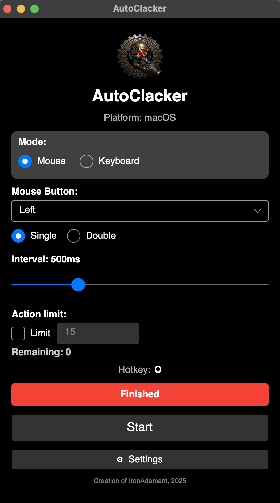

# AutoClacker

Cross-platform mouse and keyboard click automation, built with Avalonia UI and .NET 10.

**Open source** under the [MIT License](Docs/LICENSE.txt) (copyright Aron Amos). Creation of IronAdamant, 2025.

<p align="center">
  
</p>



Windows, macOS, and Linux are targeted. There is **no installer**: run from source with `dotnet run`, or publish a portable self-contained binary and run that file.

## Features

- **Mouse mode** — left / right / middle button, single or double click
- **Keyboard mode** — repeat a chosen key
- **Optional action counter** — a checkbox plus a count field:
  - **Unchecked**, or the count field **empty / unset** → the session runs until you stop it (infinite)
  - **Enabled** with a positive integer **N** → remaining counts down by one per action; when remaining reaches **0**, all automation stops
- Global hotkey start/stop (default **F6**)
- Interval 10–2000 ms
- Settings persisted under the OS app-data directory as `AutoClacker/settings.json`
- **Optional debug log** — Settings checkbox **Write debug log** (visible on Windows, macOS, and Linux). Unchecked: no debug log writes. Checked: Info lines are written to `AutoClacker/debug.log` under app data. Windows may also show a debug console (separate checkbox, Windows only).
- Native P/Invoke per OS (no helper tools like xdotool)
- Capability-aware UI: will not pretend to “Run” when input is unavailable

## Status

| Platform | Input | Global hotkey | Notes |
|----------|-------|---------------|--------|
| **Windows** | Supported | Supported | Primary / best-tested path |
| **macOS** | Requires Accessibility | Requires Accessibility | Grant in System Settings → Privacy & Security → Accessibility |
| **Linux** | X11 / XWayland | X11 / XWayland | Pure Wayland without XWayland is **not** supported |

## Layout

One solution (`AutoClacker.slnx`), shared UI, three OS platform modules:

```text
src/
  AutoClacker.Core/       # Contracts, settings, click session (no Avalonia)
  AutoClacker.App/        # Avalonia UI + view models
  AutoClacker.Windows/    # WindowsPlatform facade
  AutoClacker.MacOS/      # MacOSPlatform facade
  AutoClacker.Linux/      # LinuxPlatform facade
  AutoClacker.Desktop/    # Host / composition root
tests/
  AutoClacker.Core.Tests/
```

The app depends only on `IPlatformServices`. OS selection happens in `Desktop` only.

## Build, test, run

Requires the **.NET 10** SDK.

```bash
dotnet build AutoClacker.slnx -c Release
dotnet test  AutoClacker.slnx -c Release

# Run from source (repo root)
dotnet run --project src/AutoClacker.Desktop -c Release
```

## Portable publish (no installer)

Self-contained, single-file output. Copy the published folder and run the binary — no MSI, DMG, pkg, or setup wizard.

The **host RID** is the runtime identifier of the machine you are building on (`dotnet --info`, look for `RID:`). Publishing with that RID produces a binary for this computer. You can also pass another RID to cross-publish.

```bash
# Host RID (this machine)
./scripts/publish.sh

# Explicit targets
./scripts/publish.sh win-x64
./scripts/publish.sh linux-x64
./scripts/publish.sh osx-arm64
```

Equivalent `dotnet publish` (output under `publish/`, which is gitignored):

```bash
dotnet publish src/AutoClacker.Desktop -c Release -r win-x64   --self-contained -p:PublishSingleFile=true -o publish/win-x64
dotnet publish src/AutoClacker.Desktop -c Release -r linux-x64 --self-contained -p:PublishSingleFile=true -o publish/linux-x64
dotnet publish src/AutoClacker.Desktop -c Release -r osx-arm64 --self-contained -p:PublishSingleFile=true -o publish/osx-arm64
```

Then run `publish/win-x64/AutoClacker.exe` on Windows, `./publish/linux-x64/AutoClacker` on Linux, or open `publish/osx-arm64/AutoClacker.app` on macOS (`scripts/publish.sh osx-arm64` wraps a named `.app` bundle so the menu bar says **AutoClacker**, not “Avalonia Application”).

`scripts/publish.sh` takes an optional RID argument and defaults to the current host RID.

## Platform notes

- **Windows:** Desktop input injection needs no extra permission for normal use. Optional debug console in Settings.
- **macOS:** Accessibility is required for both injection and the global hotkey. The UI surfaces unavailability when trust is missing. Grant AutoClacker (or your terminal / IDE if you `dotnet run`) in System Settings → Privacy & Security → Accessibility. Optional **Write debug log** (Settings) writes to `~/Library/Application Support/AutoClacker/debug.log`. During keyboard automation, click another window so injected keys do not land on AutoClacker itself.
- **Linux:** Uses `libX11` / `libXtst`. An X11 session or XWayland is required. Holding the hotkey does not thrash start/stop (auto-repeat suppressed).

## License

MIT — see [`Docs/LICENSE.txt`](Docs/LICENSE.txt). Copyright (c) 2025 Aron Amos.

Creation of IronAdamant, 2025.
